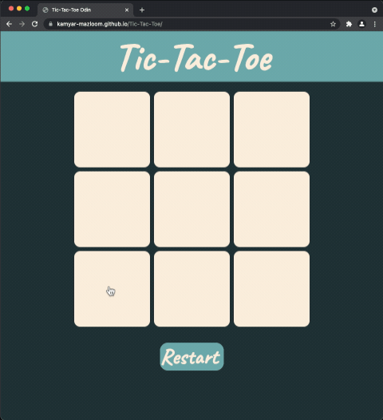

# Tic Tac Toe

From [the Odin Project](http://www.theodinproject.com/courses/web-development-101/lessons/html-css)'s JS curriculum.

This project is meant for practicing freshly gained knowledge of Object constructors, DOM manipulation, IIFEs & module patterns

[Live Demo](https://kamyar-mazloom.github.io/Tic-Tac-Toe/) :point_left:

